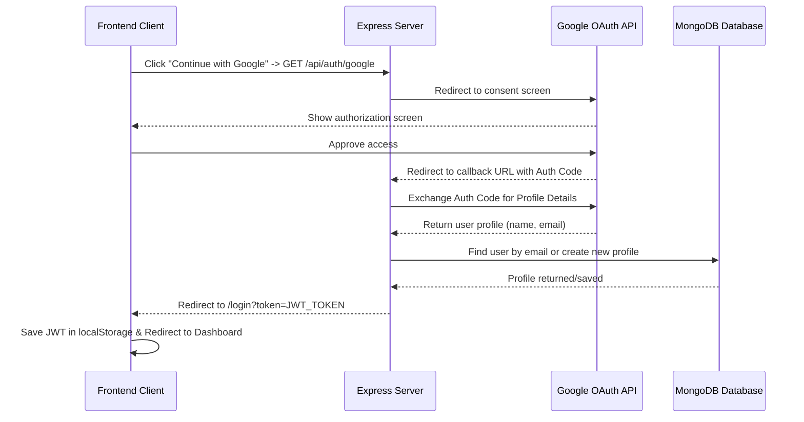

# 🌟 PromptCraft AI

[](https://nextjs.org/)
[](https://react.dev/)
[](https://expressjs.com/)
[](https://www.mongodb.com/)
[](https://tailwindcss.com/)
[](https://deepmind.google/technologies/gemini/)
[](https://jwt.io/)

A modern, portfolio-grade AI-powered prompt engineering platform built with Next.js, Express.js, MongoDB, Google Gemini AI, and Passport.js Google OAuth. 

PromptCraft AI enables creators, marketers, developers, and writers to easily design, refine, organize, and share templates for AI prompt engineering with rich visual analytics, historical tracking, and community collaboration.

---

## 🔗 Links

- **Live Demo**: https://prompt-craft-ai-wine.vercel.app
- **Frontend Repository**: https://github.com/taniashahida-dev/Prompt-Craft-AI
- **Backend Repository**: https://github.com/taniashahida-dev/Prompt-Craft-AI/tree/main/server

---

## 🎨 Project Overview

PromptCraft AI is a complete full-stack SaaS application tailored for prompt engineers. It bridges the gap between raw prompts and highly optimized AI outputs. Users can experiment inside the AI Workspace, structure templates, improve prompts using specialized JSON schemas, share resources inside the Explore page, and track usage trends with interactive Recharts overview dashboards.

---

## ✨ Features

- **⚡ AI Content Generator (Workspace)**: Experiment, refine, and generate real AI content dynamically based on topic, content type, tone, and desired length. Powered by the official `@google/genai` SDK.
- **✨ AI Prompt Improver**: Transform weak prompts into production-grade prompts automatically using structured output schemas (improved prompt, structure, guidelines, and context).
- **⏳ AI History**: Review and search all past AI prompt generations and optimizations, saved automatically in MongoDB.
- **🌐 Public Template Gallery (Explore)**: Find and filters community prompts by tags, categories, difficulty, or usage count.
- **📁 Template Management**: Complete CRUD operations to build, edit, and manage personalized prompt templates.
- **🔒 Google Authentication & Security**: Complete secure sign-in flow utilizing `Passport.js` Google OAuth 2.0 alongside JWT authentication and automatic profile registrations.
- **📊 Dashboard Analytics**: Beautiful, interactive overview analytics with chart visualizations (using Recharts) tracking prompt usage counts, success rates, and category logs.
- **📱 Premium Responsive Design**: Stunning glassmorphism layouts, custom UI toasts (via React Hot Toast), and dark theme accents configured cleanly on desktop and mobile viewports.

---

## 🛠️ Tech Stack

### Frontend
- **Framework**: Next.js 16 (App Router)
- **Library**: React 19
- **Styling**: Tailwind CSS v4 & custom glassmorphism systems
- **Charts**: Recharts
- **Toasts**: React Hot Toast
- **Icons**: Lucide React
- **Querying**: Axios + TanStack React Query

### Backend
- **Framework**: Express.js
- **Runtime**: Node.js
- **OAuth & Auth**: Passport.js (`passport-google-oauth20`) + JSON Web Token (`jsonwebtoken`)
- **Password Hashing**: Bcryptjs

### Database
- **ODM**: Mongoose
- **Database**: MongoDB (MongoDB Atlas / local instances)

### AI Integration
- **SDK**: Official `@google/genai` Node.js SDK
- **Model**: `gemini-3.5-flash`

---

## 📂 Folder Structure

```
PromptCraft AI/
├── public/                 # Static public assets
├── src/                    # Next.js Frontend source code
│   ├── app/                # App Router directories (login, workspace, explore, templates)
│   ├── components/         # Reusable frontend layout components (Navbar, Footer)
│   ├── context/            # AuthContext and TanStack QueryProvider setups
│   └── utils/              # Client centralized configs and Axios instance
├── server/                 # Express.js Backend source code
│   ├── config/             # Passport.js configurations & MongoDB connections
│   ├── controllers/        # Express route handler logic
│   ├── middleware/         # Route protectors & JWT verification hooks
│   ├── models/             # Mongoose schemas (User, Prompt, Template)
│   ├── routes/             # Backend API endpoint declarations
│   └── utils/              # Seed scripts and Gemini helper utilities
└── README.md               # Portfolio-quality documentation
```

---

## 🚀 Installation Guide

### Prerequisites
- Node.js (v18 or higher)
- MongoDB (Local installation or MongoDB Atlas account)
- Google Cloud Console Developer account (for Google Sign-In)
- Google AI Studio API Key (for Gemini AI)

### 1. Clone & Install dependencies
```bash
git clone [Insert Git Repository URL Here]
cd PromptCraft-AI
npm install
```

### 2. Configure Backend
Navigate to the `server` folder, install dependencies, and configure environment keys:
```bash
cd server
npm install
```

### 3. Start Development Servers
Run the backend server (from the `/server` folder):
```bash
npm run dev
```

Run the Next.js frontend (from the project root folder):
```bash
cd ..
npm run dev
```
Open [http://localhost:3000](http://localhost:3000) to preview the app.

---

## ⚙️ Environment Variables

### Frontend (`.env.local` or Vercel Environment Variables)
Create a `.env.local` file at the root of the project:
```env
# URL of your Render backend API
NEXT_PUBLIC_API_URL=http://localhost:5000/api
```

### Backend (`server/.env` or Render Environment Variables)
Create a `.env` file inside the `server/` directory:
```env
PORT=5000
MONGO_URI=mongodb://localhost:27017/promptcraft
JWT_SECRET=production_supersecret_token_signature_key_change_me
JWT_EXPIRE=30d

# Google Gemini API Key
GEMINI_API_KEY=your_gemini_api_key_here

# Google OAuth Credentials
GOOGLE_CLIENT_ID=your_google_client_id_here.apps.googleusercontent.com
GOOGLE_CLIENT_SECRET=your_google_client_secret_here
GOOGLE_CALLBACK_URL=http://localhost:5000/api/auth/google/callback

# Frontend URL
CLIENT_URL=http://localhost:3000
```

---

## ⚡ Available Scripts

### Frontend (Root Directory)
- `npm run dev`: Runs the Next.js frontend dev server.
- `npm run build`: Compiles Next.js production builds.
- `npm run lint`: Verifies ESLint configurations.
- `npm run start`: Starts compiled production bundles locally.

### Backend (`/server` Directory)
- `npm run dev`: Runs server using nodemon for automatic file tracking.
- `npm start`: Starts backend using standard node runtime.

---

## 🔌 API Overview

### Authentication Routes
- `POST /api/auth/register` - Registers a new email account (auto-logins).
- `POST /api/auth/login` - Standard email/password user login.
- `GET /api/auth/google` - Passport entry point initiating Google OAuth.
- `GET /api/auth/google/callback` - Passport callback redirection.
- `GET /api/auth/profile` - Retrieves active authenticated user details.

### AI generation Routes
- `POST /api/prompts/generate` - Generates dynamic AI content based on parameters.
- `POST /api/prompts/improve` - Enhances user prompt using structured outputs.

### Template Routes
- `GET /api/templates` - Fetches community templates (supports search, sort, filter).
- `POST /api/templates` - Creates a new template.
- `PUT /api/templates/:id` - Updates an existing template.
- `DELETE /api/templates/:id` - Deletes a template.

---

## 🔐 Authentication Flow



---

## 📸 Screenshots

*Insert portfolio screenshots here:*
- **Dashboard**: `
`
- **AI Workspace**: `
`
- **Explore Gallery**: `
`

---

## 🚀 Deployment Instructions

### 1. Database Setup: MongoDB Atlas
1. Sign in to your [MongoDB Atlas account](https://www.mongodb.com/cloud/atlas).
2. Create a new Database Cluster and click **Connect**.
3. Under **Connect to your application**, select the Driver as **Node.js** and copy the connection string.
4. Replace `<password>` and database name in the URI with your credentials. Keep this URL safe for Render environment variables.

### 2. Backend Deployment: Render
1. Sign in to [Render](https://render.com/).
2. Click **New** -> **Web Service** and connect your GitHub repository.
3. Configure the following service settings:
   - **Root Directory**: `server`
   - **Build Command**: `npm install`
   - **Start Command**: `npm start`
4. Add all environment variables (shown in backend `.env` section) in Render configuration settings.

### 3. Frontend Deployment: Vercel
1. Sign in to [Vercel](https://vercel.com/).
2. Click **Add New** -> **Project** and select your GitHub repository.
3. Vercel automatically detects the Next.js project. Configure the settings:
   - **Root Directory**: `./` (Root directory of the repository)
   - **Build Command**: `npm run build`
   - **Install Command**: `npm install`
4. Add `NEXT_PUBLIC_API_URL` pointing to your deployed Render URL.
5. Click **Deploy**.

---

## 🔮 Future Improvements

- Add a collaborative real-time team workspace feature.
- Integrate token count estimators and cost estimation trackers.
- Add user profile customization (avatars, bio, and social links).
- Add support for multiple LLM providers (Claude, GPT-4, Llama).

---

## 👤 Author Information

- **Name**: Tania
- **LinkedIn**: https://www.linkedin.com/in/tania9
- **Portfolio**: https://tania-webdev.vercel.app/

---

